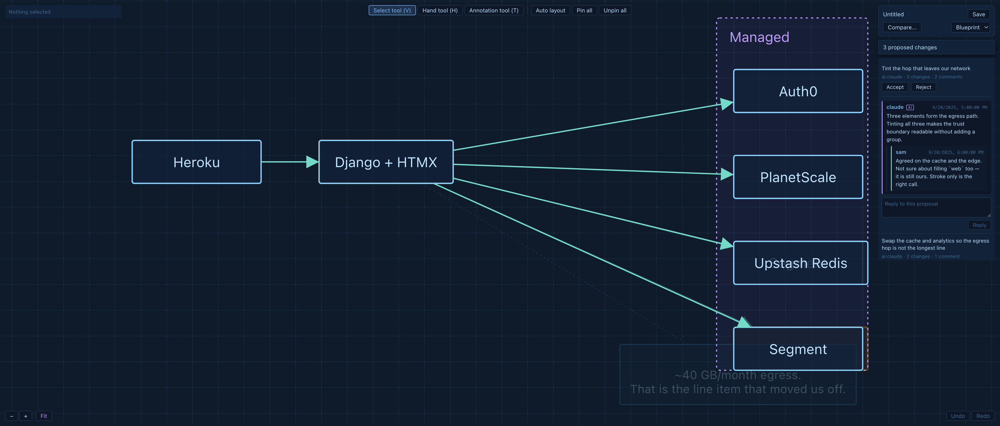
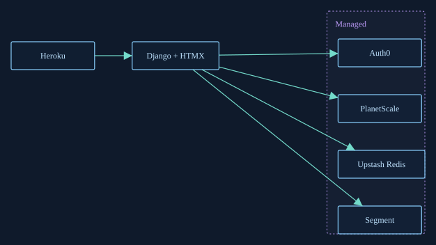
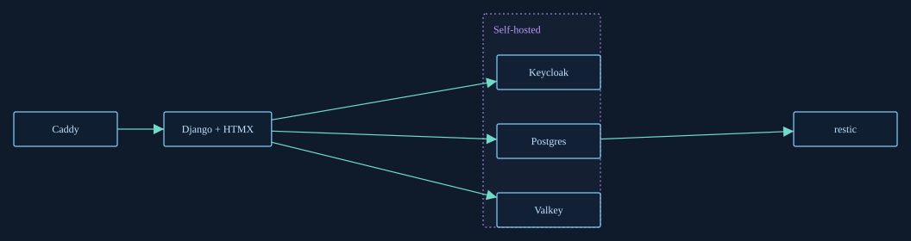
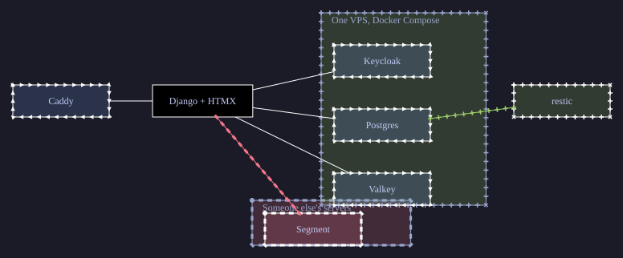
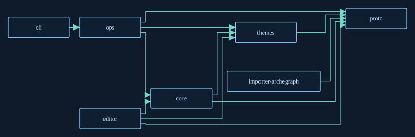

# archeglyph

[](https://qtpi-bonding.github.io/archeglyph/?gh=qtpi-bonding/archeglyph&path=examples/stack-managed.diag.json)
[](LICENSE)

A diagram preparation system for node-and-edge graphs, with a visual editor.
Deterministic SVGs you can commit to git and review in a pull request, where
agents and humans propose changes, comment, and annotate.

The graph topology lives in one text file. The visual styling lives in a sidecar file. The tool deterministically renders an SVG you can commit to git and embed in PRs and docs.

### → [Try the editor in your browser](https://qtpi-bonding.github.io/archeglyph/?gh=qtpi-bonding/archeglyph&path=examples/stack-managed.diag.json)

No install, no account. That link opens the diagram below — pulled from
`examples/` in this repo — with its three proposed changes waiting for review.
Everything runs in the page; nothing is uploaded. To edit your own files
instead, open the editor with [no parameters](https://qtpi-bonding.github.io/archeglyph/)
and pick them off disk.



<sub>The editor, reviewing three proposed changes. Two came from an agent and
one from a person; each carries a description, a change count and a discussion
thread, and each is accepted or rejected on its own. A proposal never touches
the saved file until it is accepted — it lives in `Stylesheet.pending_edits`
and draws as the ghost you can see behind the canvas. Regenerate with
`bun run editor:screenshot`.</sub>

**Status:** pre-1.0. The engine, all seven CLI operations and the visual editor
are shipped and tested; there is no npm package and no user guide beyond the
generated CLI reference. Design spec in
[`docs/design.md`](docs/design.md), the full list of what is missing in
[`docs/status.md`](docs/status.md).

## What it is

Four properties, in order of importance:

1. **Content is canonical.** The text file *is* the graph. Topology cannot be edited via the visual editor. The visual editor only writes to the style sidecar.
2. **Output is deterministic.** Same `(content, style, theme, archeglyph version)` → byte-identical SVG. Git diffs of generated SVGs are meaningful.
3. **Every edit is a typed operation on the style file** — whether it came from a human, the CLI, or an agent. There is no separate "AI mode"; agents read and write the same files, through the same operations, and their proposals land in `pending_edits` for a human to accept or reject.
4. **Change is a first-class object.** `diff` computes a typed change set between two revisions of a diagram, and the renderer draws it — added, changed and deleted elements coloured in place, with deletions still shown rather than silently absent. A diagram becomes reviewable in a pull request rather than a before-and-after a reader has to hold in their head.

<table>
<tr>
<td width="50%"></td>
<td width="50%"></td>
</tr>
<tr>
<td align="center"><sub><b>before</b></sub></td>
<td align="center"><sub><b>after</b></sub></td>
</tr>
</table>



<sub>The third picture is not drawn by hand either — it is `archeglyph diff`
between the first two, rendered with `render --delta`. Everything replaced is
drawn twice: struck through in red where it left, and in green where it
arrived. The plain box in the middle is the application, which the migration
did not touch. It uses the `dark` theme because `light` and `dark` declare
colours for added, changed and deleted, where `blueprint` declares none and
rotates hue instead.</sub>

archeglyph is a kernel + adapters: a general-purpose node/edge engine, with importers for archegraph and (later) DOT/Mermaid/JSON. It is not coupled to archegraph; archegraph is one consumer.

## Install

**Requires [Bun](https://bun.sh) 1.3 or newer.** The CLI is TypeScript executed
directly by Bun; there is no build step and no compiled binary.

```bash
git clone https://github.com/qtpi-bonding/archeglyph
cd archeglyph
bun install
```

Cloning is the only route today: every workspace package is still `0.0.0`, so
`bunx archeglyph` has nothing to fetch.

Confirm it works by rendering a bundled example:

```bash
bun run archeglyph render \
  --diagram examples/stack-managed.diag.json \
  --style   examples/stack-managed.style.json \
  --theme   blueprint \
  --out     stack.svg
```

For the visual editor, which writes only to the stylesheet:

```bash
bun run dev:editor
```

It serves locally at the address Vite prints. The same build is hosted at
**<https://qtpi-bonding.github.io/archeglyph/>** if you would rather not clone
anything — it reads and writes files on your own machine through the File
System Access API, so nothing you open is uploaded.

**Everything else is in
[`skills/archeglyph-manual/SKILL.md`](skills/archeglyph-manual/SKILL.md)** —
every subcommand and flag, with types, defaults, and which are required. It is
generated from the same operation registry the CLI parses its flags from, so it
cannot document something that does not exist, and CI fails when it falls
behind. `archeglyph <subcommand> --help` prints the same content at a terminal.

It is written as an agent skill because coding agents are a first-class caller
here: point one at that file and it has the whole surface.

## Family

The name is *archē* (ἀρχή, origin/principle) + *glyphē* (γλυφή,
carving/inscription) — the carved form of an origin graph.

The origin graph in question is **archegraph**, a code-architecture verifier
that extracts a structural graph from a codebase. archeglyph is its first
from-scratch dogfood target, and the two co-evolved. archegraph is not public
yet.



<sub>Not a drawing — archegraph indexed this repository and archeglyph
rendered the result.</sub>

This diagram is archegraph's view of this repository,
rolled up to one node per workspace package — an edge means one package's
source names something from another's. Regenerate it with `bun run
scripts/architecture_diagram.ts`. The `.archegraph/specs/` directory and the
`spec/<pillar>-v1` tags hold the build history of every pillar here, if you
would rather check that than take it on trust.

archeglyph does not depend on any of it. It is a general node-and-edge engine;
archegraph is one importer, alongside DOT, Mermaid and JSON later.

## How it works (overview)

```
content.diag.json    ──┐
                        ├─► loader ─► resolver ─► layout (elkjs) ─► renderer ─► output.svg
style.style.json     ──┤
                        │
theme.theme.json     ──┘
(optional)
```

- **content** — graph topology (nodes, edges, groups, localizable labels, tags)
- **style** — per-element layout, visual overrides, component bindings, annotations
- **theme** — design system: tokens (colors, fonts, sizes) + named components

All three files are canonical proto3 JSON. The renderer emits a deterministic SVG with an embedded provenance comment.

## Tech stack

- **Language:** TypeScript
- **Runtime:** [Bun](https://bun.sh)
- **Schemas:** Protocol Buffers via `@bufbuild/protobuf` + `buf` CLI
- **Layout engine:** [elkjs](https://github.com/kieler/elkjs)
- **SVG rendering:** hand-rolled (template strings)
- **Web framework (editor):** SolidJS
- **CLI parsing:** citty
- **Tests:** bun test + golden SVG snapshots

## Visual primitives

The styling vocabulary is organized as three orthogonal "glyph" types:

- **Glyph2D** — visual identity of a shape-based element (Node, Group, Annotation): geometry + outline + fill + halo + decorations
- **Glyph1D** — visual identity of a line-based element (Edge, Annotation callout): stroke + arrowheads + glow
- **Typography** — visual identity of text: font, color, size, weight, alignment, visibility

Themes ship reusable named components composing these glyphs. Stylesheets bind elements to theme components by name; binding logic (e.g., "all backend services use this preset") lives in tools (`archeglyph bind` CLI, importers, AI agents) which produce explicit per-element bindings as their output.

## Design principles

See [`docs/design.md` §2](docs/design.md) for the full set. Highlights:

- **Content/style separation** — visual editor never writes to content
- **Schema-first extensibility** — schemas accommodate every planned feature; the implementation may be slimmer
- **Determinism** — same inputs → byte-identical SVG, with provenance comment
- **Kernel + adapters** — core is general; archegraph is one importer
- **Host-agnostic visual editor** — abstract HostAdapter; standalone web (v1), VS Code extension (later), native (later)
- **Structural defaults in code, stylistic in schema** — schema captures data; merge mechanics live in code

## A note on agent-local files

Some files the design docs mention are deliberately unpublished, because they
describe one machine rather than the project: `CLAUDE.md`, `.claude/skills/`
(a symlink into a sibling checkout), and `docs/comparisons/`. A reference to
one in `docs/` is a record of how the work was done, not a broken link.

## License

**[GNU Affero General Public License v3.0 or later](LICENSE)** (AGPL-3.0-or-later).

Why AGPL: archeglyph is meant to stay open. AGPL ensures forks — including network-served forks like a hosted public instance — also remain open. You can use archeglyph freely (locally, in your project, on your own infra); modifications you distribute or host as a service must be shared back under the same license. Internal use is unrestricted.

Files include `SPDX-License-Identifier: AGPL-3.0-or-later` headers as a short-form indicator.
